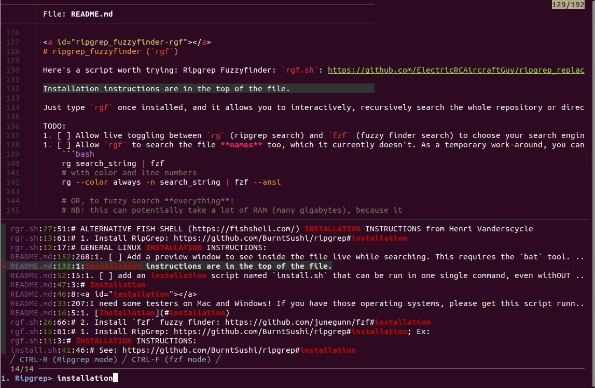
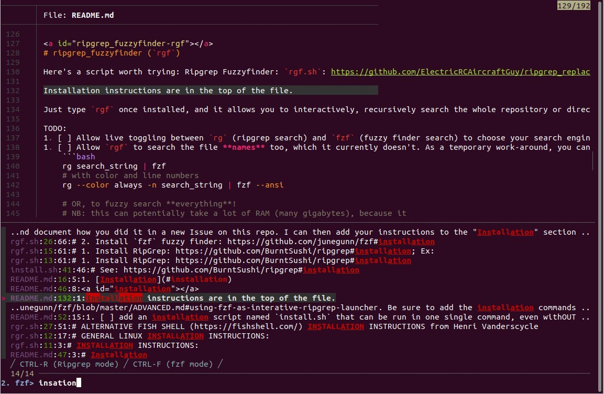

[](https://hits.seeyoufarm.com)

[>> Become my 1st Sponsor on GitHub <<](https://github.com/sponsors/ElectricRCAircraftGuy)


# Ripgrep Replace (`rgr`), and fuzzy finder search tools


# Table of Contents
<details>
<summary><b>(click to expand)</b></summary>
<!-- MarkdownTOC -->

1. [Help needed](#help-needed)
1. [Status](#status)
1. [Installation](#installation)
1. [ripgrep fuzzyfinder with preview window \(`rgf2`\)](#ripgrep-fuzzyfinder-with-preview-window-rgf2)
1. [ripgrep_replace \(`rgr`\)](#ripgrep_replace-rgr)
    1. [Example usage:](#example-usage)
1. [ripgrep_fuzzyfinder \(`rgf`\)](#ripgrep_fuzzyfinder-rgf)
1. [Fuzzy searching for files by filename: manually, and with `sublf`](#fuzzy-searching-for-files-by-filename-manually-and-with-sublf)
1. [Alternatives to `rgr`](#alternatives-to-rgr)
1. [Other, very-useful repos:](#other-very-useful-repos)

<!-- /MarkdownTOC -->
</details>

TODO: [https://github.com/ElectricRCAircraftGuy/ripgrep_replace/issues/1]: add gif demo image here


<a id="help-needed"></a>
# Help needed

I need some testers on Mac and Windows! If you have those operating systems, please get this script running and document how you did it in a new Issue on this repo. I can then add your instructions to the "Installation" section in this readme, below.

- [x] test on Linux Ubuntu
- [ ] test on MacOS
- [ ] test on Windows


<a id="status"></a>
# Status

Both `rgr` and `rgf` are done and fully implemented and work well. 


<a id="installation"></a>
# Installation

For now, just see the top of each file for instructions in the comments. 

TODO:
1. [ ] add an installation script named `install.sh` that can be run in one single command, even withOUT downloading the repo manually first! Ex. cmd of what this might look like (see [here](https://github.com/ElectricRCAircraftGuy/BrosTrendWifiAdapterSoftware#repo-status) for a demo of this type of cmd):
    ```bash
    wget https://github.com/ElectricRCAircraftGuy/ripgrep_replace/blob/main/install.sh -O /tmp/ && /tmp/install.sh
    ```


<a id="ripgrep-fuzzyfinder-with-preview-window-rgf2"></a>
# ripgrep fuzzyfinder with preview window (`rgf2`)

#### How to use `rgf2`

`cd` into any location you want, and run `rgf2`. Search for anything you want. It will recursively search all files in all directories at this point and down, showing a preview of the match in the file, with surrounding context, in the top pane. 

By default it does a ripgrep search. Notice the instructions at the very bottom: 

> / CTRL-R (Ripgrep mode) / CTRL-F (fzf mode) /

Press <kbd>Ctrl</kbd> + <kbd>F</kbd> to switch to fzf fuzzy search mode. Press <kbd>Ctrl</kbd> + <kbd>R</kbd> to switch back to ripgrep search mode.

Press <kbd>Ctrl</kbd> + <kbd>Q</kbd> or <kbd>Ctrl</kbd> + <kbd>C</kbd> to quit the program.

Here is a screenshot of what it looks like doing a _ripgrep_ search for `installation` in this very repo: 

<p align="left" width="100%">
    <a href="images/rgf2_ripgrep_demo.jpg">
         
    </a>
</p>

Here is what it looks like doing an _fzf_ fuzzy search for `insation`, which finds the same thing:

<p align="left" width="100%">
    <a href="images/rgf2_fzf_demo.jpg">
         
    </a>
</p>


<a id="ripgrep_replace-rgr"></a>
# ripgrep_replace (`rgr`)

ripgrep_replace, or `rgr`, is a light-weight wrapper around [ripgrep](https://github.com/BurntSushi/ripgrep) (`rg`), supporting 100% of ripgrep's features + adding `-R` to enable on-disk find-and-replace!

Finally, we can use ripgrep, the world's fastest grep (regular expression search) tool to do rapid code refactoring via find-and-replace name changes from the command-line!

The Ripgrep author [says here](https://github.com/BurntSushi/ripgrep/issues/74#issuecomment-1191336022):

> I am _never_ going to add this [replace in files] to ripgrep. It isn't happening.
> 
> Normally I would lock this issue. But folks are still posting helpful content about other approaches. So I'm going to leave this open, but I'm going to mark comments asking for this to be in ripgrep as off topic.
> 
> There is no hope. It will never happen. Final decision.

Ripgrep_replace's primary purpose, therefore, is to add "replace in files" to ripgrep via the `-R` option. See `rgr -h` for details.

<a id="example-usage"></a>
#### Example usage:

Let's standardize the delimiters in a CSV data log file. Imagine it used commas (`,`) and tabs (`\t`) as column delimiters, and you just want to force all groups of commas and tabs to be replaced by simple commas so that you can parse the data easier. Here is how:

```bash
# Find all files which end in .log. This allows you to ensure it will only
# affect the files you want it to affect.
rg '' -g '*.log' -l | sort -V

# do a dry-run replacement to replace all delimiters of commas or tabs
# (treating sequential chars as a single delimiter), to replace them with a
# comma
time rg '[,\t]+' -r ',' -g '*.log'

# Now ensure rgr has the same dry-run output as above
time rgr '[,\t]+' -r ',' -g '*.log'

# CAUTION: DO A DRY-RUN ABOVE FIRST! Now use `-R` to actually do the
# replacement. THIS WILL OVERWRITE YOUR FILES! It updates them in-place.
time rgr '[,\t]+' -R ',' -g '*.log'
```

Note: even better, for the above usage, just use Python and the Pandas data analysis module though. See: https://github.com/ElectricRCAircraftGuy/eRCaGuy_hello_world/blob/master/python/pandas_read_csv_write_to_csv__convert_csv_delimiters.py. Simplified example:
```py
import pandas as pd 

file_in = "data.log"
file_out = "data.csv"

# read a file in which may have any number or mixed combination of commas or tabs as separators
dataframe = pd.read_csv(
    file_in,
    sep=r"[,\t]+", # allow any number of either commas or tabs as the separator
    header=0,  # the first non-blank row is the header
    # NB: using the "python" engine instead of the default "c" engine is much slower, but allows
    # us to have a regex `sep` separator value above, instead of just specifying a single
    # character. When logging files, just use a plain, single comma (`,`) as the separator in
    # order to avoid this problem.
    engine="python",
    skip_blank_lines=True,
)

# write a pure CSV file out, using only a single comma as the separator
dataframe.to_csv(file_out, sep=",", index=False)

# Now you can import it next time like this:
file_in = "data.csv"
dataframe = pd.read_csv(file_in)
```


<a id="ripgrep_fuzzyfinder-rgf"></a>
# ripgrep_fuzzyfinder (`rgf`)

Here's a script worth trying: Ripgrep Fuzzyfinder: `rgf.sh`: https://github.com/ElectricRCAircraftGuy/ripgrep_replace/blob/main/rgf.sh. 

Installation instructions are in the top of the file.

Just type `rgf` once installed, and it allows you to interactively, recursively search the whole repository or directory you are in. It uses `rg` (ripgrep) under the hood as the regex search engine to search for any string, and `fzf` (fuzzy finder) in this case provides just the interactive interface. 

TODO: 
1. [ ] Allow live toggling between `rg` (ripgrep search) and `fzf` (fuzzy finder search) to choose your search engine: https://github.com/junegunn/fzf/blob/master/ADVANCED.md#switching-between-ripgrep-mode-and-fzf-mode
1. [ ] Allow `rgf` to search the file **names** too, which it currently doesn't. As a temporary work-around, you can do this, however, to search file _names_ as well:
    ```bash
    rg search_string | fzf
    # with color and line numbers
    rg --color always -n search_string | fzf --ansi

    # OR, to fuzzy search **everything**! 
    # NB: this can potentially take a lot of RAM (many gigabytes), because it 
    # loads **all file contents** in this folder and down into RAM, to be
    # searched.   
    rg --hidden -L '' | fzf
    # With color and line numbers
    rg --hidden -L --color always -n '' | fzf --ansi
    ```
1. [ ] Add a preview window to see inside the file live while searching. This requires the `bat` tool. See this example and screenshot, for instance: https://github.com/junegunn/fzf/blob/master/ADVANCED.md#using-fzf-as-interative-ripgrep-launcher. Be sure to add the installation commands of `bat` to the top of `rgf` once you add this dependency. 
1. [ ] Add a feature that keeps the last screen of `fzf` output still on the screen even after killing the program and exiting. This would be like what the `-X` does in `less -RFX filename` (see [here](https://stackoverflow.com/a/61961629/4561887)).


<a id="fuzzy-searching-for-files-by-filename-manually-and-with-sublf"></a>
# Fuzzy searching for files by filename: manually, and with `sublf`

To search for files in a directory or repo, do: 

```bash
find | fzf -m
```

Then, use the arrow keys to move the selector up and down. Press <kbd>Tab</kbd> to toggle a file selection on and off. Press <kbd>Enter</kbd> to return from the `fzf` program and print out the paths to your files you selected. Open these files manually in whatever editor you see fit. 

OR, use my [`sublf`](https://github.com/ElectricRCAircraftGuy/eRCaGuy_dotfiles/blob/master/useful_scripts/sublf.sh) program (Sublime Text file fuzzy finder) to find, select, and automatically open all selected files in either Sublime Text or the editor of your choice (see below).

Add a [`~/.sublf_config.sh`][sublf_config] config. file to allow customizing the default options passed to `find` inside `sublf`. For the most-correct `find -not` type syntax to excluded certain files or directories, see my detailed answer here: [How do I exclude a directory when using `find`?](https://stackoverflow.com/a/69830768/4561887)

TODO:
1. [ ] Allow setting a _default editor_ as well inside the `~/.sublf_config.sh` configuration file. For now, you can simply change the `subl "${files_selected_array[@]}"` command near the bottom of the `sublf.sh` script to explicitly use the editor of your choice. Ex: open in vim with `vim "${files_selected_array[@]}"`.


<a id="alternatives-to-rgr"></a>
# Alternatives to `rgr`

TODO: see: https://github.com/ElectricRCAircraftGuy/ripgrep_replace/issues/1#issuecomment-1250639089


<a id="other-very-useful-repos"></a>
# Other, very-useful repos:

1. My [eRCaGuy_dotfiles](https://github.com/ElectricRCAircraftGuy/eRCaGuy_dotfiles) repo.
1. My [eRCaGuy_hello_world](https://github.com/ElectricRCAircraftGuy/eRCaGuy_hello_world) repo.


  [sublf_config]: https://github.com/ElectricRCAircraftGuy/eRCaGuy_dotfiles/blob/master/home/.sublf_config.sh
